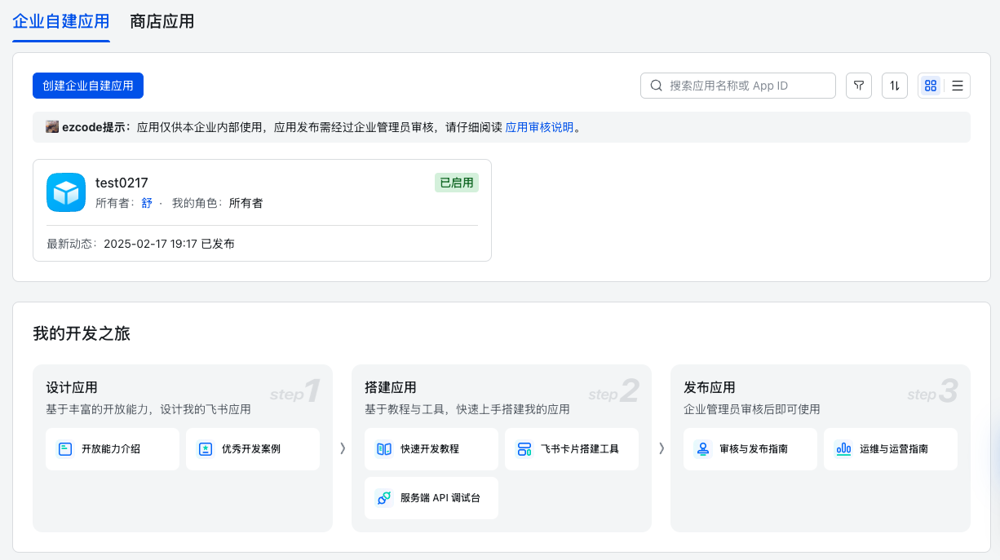
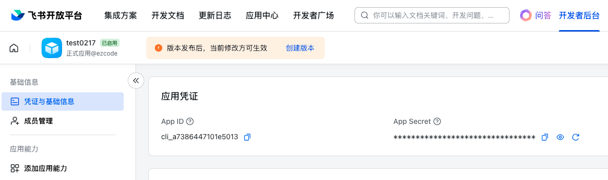

# Export feishu docs in Python

飞书云文档知识库导出

[toc]

## 功能说明

说明：虽然飞书提供了相关API，但串联方法依然非常耗时。比如：知识库介绍不全面；不同的文件，比如 pdf、sheet、docx 是不同的导出方式，等等。

这里主要实现：

1、获取知识库列表

2、单个知识库信息

3、迭代导出知识库各层级不同类型文件  

***

### 相关链接

- 服务端 SDK 概述
  <https://open.feishu.cn/document/server-docs/server-side-sdk>
- 云文档概述：<https://open.feishu.cn/document/server-docs/docs/docs-overview> 
- Python SDK 指南
  <https://open.feishu.cn/document/uAjLw4CM/ukTMukTMukTM/server-side-sdk/python--sdk/preparations-before-development>  

***

## 使用方法

### 1、创建应用

开发者后台：<https://open.feishu.cn/app>   



***

记录应用信息 

App ID 和 App Secret 

<https://open.feishu.cn/app/cli_a7386447101e5013/baseinfo>  

 

***

权限管理：<https://open.feishu.cn/app/cli_a7386447101e5013/auth> 

给与充分相关权限，如果权限不足，调用时会报错 

授权后，需要重新发布版本 

***

### 2、依赖库安装

安装 Python SDK 

```shell
pip install lark-oapi -U
```

***

### 3、代码配置

在 `feishu_admin.py` 文件头部，配置上述的 `APP_ID` 和 `APP_SECRET` 信息


***

### 4、运行代码 

在 `tasks.py` 文件执行 `export_wiki_documents` 文件即可开始导出；

各个API 调用写在 `feishu_admin.py` 中； `tasks.py` 主要根据不同任务，串联方法。


***

## 欢迎贡献

由于本人时间精力有限，目前主要实现了核心的方法，并非完整的产品，使用时请更考虑安全和功能的完备。

也欢迎就我的缺陷来提出优化。

***

2025-06-15（日）


